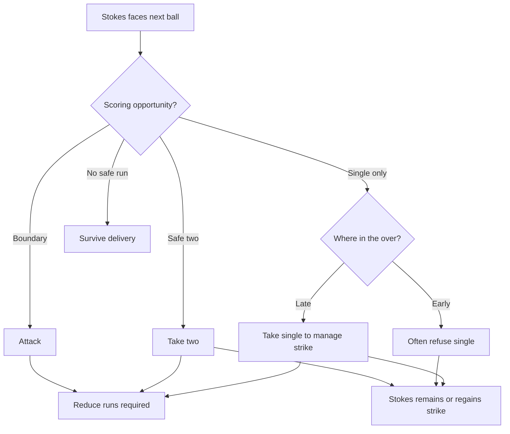
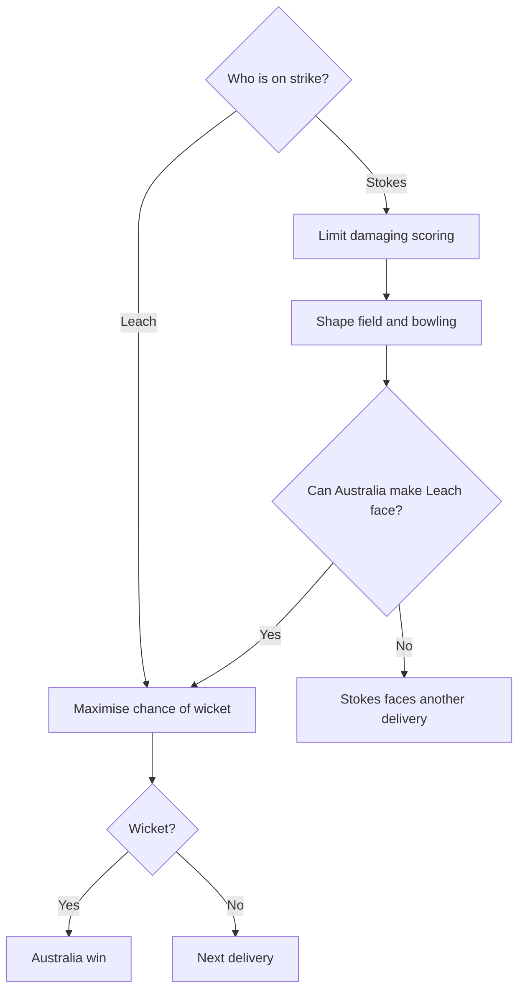

# Headingley 2019 — Reporting File

## Why this match matters

This is the primary candidate for showing the Study 21 trade-off between taking wickets and preventing runs in a real match.

The reporting task is not to retell the famous finish. It is to identify the moments where match state changed the value of runs, wickets, strike and field placement, and then establish those moments with primary or strong contemporary sources.

## Analytical question

What happens when the fielding side needs one wicket while the batting side still needs a substantial number of runs?

More specifically:

- How did Australia balance wicket-taking against boundary prevention?
- How did England manage strike between Ben Stokes and Jack Leach?
- Which field changes altered the probabilities of those outcomes?
- What did the players and captain themselves say they were trying to do?

## Facts established

- [x] Match: England v Australia, third Ashes Test, Headingley, 22–25 August 2019.
- [x] England target: 359.
- [x] England were 286/9 when Stuart Broad was dismissed and Jack Leach joined Ben Stokes.
- [x] England therefore needed 73 more runs; Australia needed one wicket.
- [x] Stokes was 61 not out when Leach arrived.
- [x] The last-wicket partnership added 76.
- [x] England won by one wicket at 362/9.
- [x] Stokes finished 135 not out; Leach finished 1 not out from 17 balls.
- [x] Stokes therefore supplied 74 of the 76 partnership runs, Leach supplied one, and one came as an extra.
- [x] This was day four of a five-day Test. There was no immediate shortage of legal deliveries comparable with a limited-overs chase; the immediate contest was principally 73 runs versus one wicket.
- [x] Nathan Lyon missed a run-out opportunity with England needing two.
- [x] Lyon then had an lbw appeal against Stokes turned down; ball-tracking showed the decision would have been overturned if Australia had retained a review.
- [x] Leach then scored his only run to level the scores.
- [x] Stokes hit Pat Cummins through cover for four to win the match.

Primary/strong sources: Cricket Australia match centre; ICC match report; BBC Sport match report; Cricket Australia final-hour reconstruction.

## Partnership reconstruction

The useful story is not simply that Stokes attacked. It is that England deliberately managed **who faced which deliveries**, while Australia tried to prevent boundaries without losing access to Leach.

### Starting state

At 286/9:

- England needed 73 runs.
- Australia needed one wicket.
- Stokes was on 61.
- Leach was the No. 11.

Leach later described a clear plan: Stokes would face roughly four or five balls of an over, Leach one or two, they would look for twos when the field was deep, and Stokes would seek boundaries.

That matters because the value of a single was conditional. A single could reduce the target by one but also hand Leach the strike; a two reduced the target while returning Stokes to strike.

### Over-by-over working reconstruction

This is deliberately a tactical summary, not a reproduced ball-by-ball commentary.

| Phase | Match state / sequence | What matters analytically | Source |
|---|---|---|---|
| Leach arrives | 286/9, 73 required; Pattinson completes a wicket maiden with Leach surviving | Maximum wicket scarcity for England: one dismissal ends the chase | Guardian live blog; Cricket Australia |
| Lyon to Stokes | Stokes hits a six and takes a late single | Attack early, preserve strike late | Guardian live blog; Cricket Australia |
| Pattinson over | Stokes declines early singles, later takes two, then a late single; Leach faces one ball | Direct evidence that one run is not always worth taking immediately | Guardian live blog |
| Lyon over | Two sixes, including reverse sweep, followed by a last-ball single | Boundary attack plus deliberate strike retention | Guardian live blog; Cricket Australia |
| Pattinson over | Stokes takes a single early enough that Leach must survive four balls | The plan sometimes fails; Leach's survival is itself part of the resource problem | Guardian live blog |
| Cummins replaces Lyon | Stokes scores rapidly, including a scoop for six | Paine changes bowler as Lyon comes under attack | Guardian live blog |
| Next over | Stokes takes two, then a late single; Leach survives one ball | Repeated pattern of twos + late single | Guardian live blog |
| Hazlewood over | 19 runs from the over; Stokes reaches 100 and reduces target sharply | Deep field does not eliminate boundary risk; scoring probability remains high | Guardian live blog |
| Lyon returns | Stokes has difficulty scoring freely, then takes a late single; Leach survives final ball | Stokes later called Lyon's return good captaincy because spin made his plan harder | Guardian live blog; Cricket Australia |
| Cummins over | Harris drops Stokes at third man; Stokes then hits boundaries and takes a single, leaving Leach two balls | Deep field creates catching opportunities too, but does not guarantee conversion | Guardian live blog; Cricket Australia |
| Lyon, eight needed | Stokes initially refuses a single, then hits six; with two needed, confusion creates Leach run-out chance; Lyon fumbles; next ball lbw appeal is denied | Australia finally has two direct wicket chances in consecutive balls | Guardian live blog; Cricket Australia |
| Final over | Leach survives two balls, scores one to tie; Stokes hits winning four | With scores tied, Australia's field comes in; the run-prevention/wicket balance changes again | Cricket Australia match centre; Guardian; Cricket Australia |

## Strike management: verified examples

The Guardian live commentary records several useful moments:

- Stokes turned down available singles early in the 118th over.
- He then ran two and took a later single, leaving Leach one ball to survive.
- At the end of the 119th over he again took a single to retain strike.
- In the 121st over he ran two and then took a late single, leaving Leach one ball.
- In the 122nd over he took a late single, again leaving Leach one ball.
- At 123.4 he wanted a second run but judged it too risky, leaving Leach two balls.
- At 124.1, with eight needed, he hit to the cover sweeper and explicitly declined the single.

This is strong evidence for the Study 21 idea that a run has no fixed tactical value independent of the state it creates next.

Leach's own account strengthens this. He said the pair had a clear plan: Stokes would face most of each over; Leach would face one or two balls; they would seek twos because Australia's field was spread.

## Decision flowcharts

These diagrams summarise the decision problems revealed by the reporting. They are not claims that either side followed a rigid algorithm on every ball; they show the broad logic of the choices available in this match state.

### England / Stokes

The important point is that the decision is not simply "score whenever possible". A scoring option also changes who is likely to face the next delivery.

### Australia

This captures the contest for control of future deliveries. England wanted as many of them as possible to be faced by Stokes; Australia wanted access to Leach while also limiting the runs Stokes could score.

## Australia’s wicket-versus-runs decisions

### The deep field

Cricket Australia's contemporary reconstruction says that, once Stokes accelerated, Tim Paine moved all but one fielder to the boundary when Stokes was on strike.

This did several things at once:

- protected against some boundaries;
- increased the chance that clean hits would become ones or twos rather than fours;
- reduced the number of close catching positions;
- made twos available if Stokes could place the ball between boundary riders;
- made late-over singles easier, helping Stokes control the strike.

Do not simplify this into "deep field = defensive". The same field could still produce a catch in the deep, as Marcus Harris's chance at third man showed.

### Paine's immediate explanation

After the match Paine defended the basic logic of spreading the field: with Stokes striking the ball that well, bringing fielders in could simply turn the same shots into fours or sixes.

But he also identified a second-order problem: when the field spread, his bowlers could become defensive in mindset. His stated preference was still for them to think about taking the wicket regardless of where the fielders stood.

This is important evidence against an overly tidy model. Field placement does not only change spatial probabilities; it can also change bowling behaviour.

### Paine's later reflection

Before the fourth Test, Paine was more specific about what he would change. He said there were moments when he should have brought the field up and accepted the possibility that Stokes would hit boundaries, because doing so could have given Australia more deliveries at Leach.

That is almost a direct practitioner statement of the Study 21 trade-off:

**concede greater run risk now in exchange for greater wicket access next.**

### Langer's post-match debrief

Reporting on the Australian documentary *The Test* records Justin Langer making essentially the same criticism in the team review. His concern was that Australia allowed Stokes a late single when the better percentage play may have been to bring the field up and give Pattinson a full over at Leach.

Paine is reported in that debrief as accepting that balls five and six were moments when the field should have come up.

Use this carefully: it is retrospective and comes through documentary/secondary reporting, not a live tactical instruction recorded on the field.

## Why Lyon complicated the plan

Stokes himself said Paine's decision to return to Nathan Lyon late in the chase was good captaincy.

His reason is analytically useful. Stokes had been trying to attack the first half of an over and then manage the strike. Lyon, bowling into helpful rough on a turning pitch, made Stokes less certain whether to continue attacking or try to finish through ones and twos.

So the Australian problem was not simply "put fielders here or there". Bowler identity changed the outcome probabilities available under the same broad match state.

This is exactly the sort of complication we should preserve rather than smooth away.

## Leach's role

Leach's contribution is easy to trivialise because the scorecard says 1 not out.

But the tactical role was explicit:

- survive the one or two balls Stokes expected him to face;
- run twos when available;
- understand that Stokes would take most of the scoring risk;
- remain calm enough to execute that limited role.

Leach later said he understood the plan clearly and knew his role within it.

He faced 17 balls and survived all of them. His single eventually tied the scores.

## The final two wicket chances

With two runs required:

1. Stokes hit towards backward point and Leach set off when Stokes did not intend to run. Cummins returned the ball to Lyon with Leach well short, but Lyon failed to gather it cleanly and complete the run-out.
2. Lyon's next ball hit Stokes on the pad. The on-field decision was not out. Australia had no review left after using the final one on an unsuccessful lbw appeal against Leach in the previous over. Ball-tracking later showed three reds.

These moments matter because they stop us writing a deterministic story. Australia's tactics created chances to win. They did not convert them.

That fits Study 21's distinction between influencing probabilities and determining outcomes.

## Field-setting reconstruction

| Match state | Batter | Bowler | Field evidence | Apparent trade-off | Source |
|---|---|---|---|---|---|
| 286/9, 73 required | Stokes/Leach | Pattinson/Lyon | Australia begins pushing field back as Stokes attacks | Protect boundary while seeking final wicket | Cricket Australia; Guardian |
| Target near 50 | Stokes | Lyon | Cricket Australia reports all but one fielder on rope for Stokes | Boundary prevention versus close catchers / strike control | Cricket Australia |
| 40 required | Stokes | Cummins | Paine removes Lyon after sustained attack | Change bowler to alter scoring/wicket probabilities | Guardian |
| 18 required | Stokes | Lyon | Lyon recalled despite deep field | Use bowler Stokes found tactically harder to manage | Guardian; Stokes post-match comments |
| 8 required | Stokes | Lyon | Deep boundary protection remains initially | Prevent winning boundary but allow Stokes to refuse/take singles strategically | Guardian |
| Scores tied | Stokes | Cummins | Field brought in | Single now loses match; run prevention becomes immediate | Cricket Australia; Guardian |

## Quotes / language worth retaining

Do not overquote in the article. These are reporting notes.

### Tim Paine

Immediate post-match theme:

- spreading the field was intended to stop Stokes finishing the match even faster;
- he acknowledged that a spread field could make bowlers think defensively;
- he still wanted bowlers thinking wicket-first.

Later reflection before Old Trafford:

- he said he would change some field placements;
- specifically, he should sometimes have accepted Stokes boundaries in order to bowl more balls at Leach.

### Ben Stokes

Useful themes:

- he said he understood what the game situation required when Leach arrived;
- he deliberately attacked the first part of overs;
- Lyon's return made him question whether to keep attacking or switch to ones and twos;
- he chose to continue with the method that had brought England that far;
- he explicitly described picking the right ball and committing to the shot.

### Jack Leach

Useful themes:

- the plan was broken into smaller pieces;
- Stokes would face four or five balls, Leach one or two;
- twos were part of the plan because the field was out;
- Leach understood that his own role was narrow and clear.

## What challenges or complicates Study 21?

### 1. A field setting is not only spatial

Paine's own comments suggest that moving fielders changed the bowlers' mindset. So a field can affect behaviour indirectly as well as altering where catches and boundaries are possible.

### 2. Run prevention and wicket-taking are not strict opposites

A boundary rider can take a catch. A deep field can tempt a batter into a riskier second run. Restricting a boundary can increase pressure. The trade-off is probabilistic, not binary.

### 3. Bowler identity matters

Stokes explicitly found Lyon harder to manage than the seamers in this phase. The same field with a different bowler is not the same tactical state.

### 4. Execution matters after the tactic

Australia created a dropped catching chance, a run-out opportunity and an lbw opportunity. None produced the wicket. Tactical choice changes opportunity; execution still determines whether the opportunity becomes an event.

### 5. Plans evolve ball by ball

The broad Stokes/Leach plan was clear, but individual deliveries forced departures from it. Sometimes Stokes exposed Leach for more balls than intended. Sometimes the available second run was too risky. The plan constrained decisions; it did not script them.

## Potential article use

Do not draft prose here. Record what explanatory job each verified moment could perform.

| Verified moment | Study 21 idea it illuminates | Why a general reader should care |
|---|---|---|
| 286/9, 73 needed | Match state changes the value of resources | Same scoreboard gives England one remaining life and Australia one remaining task |
| Stokes declines early singles | Runs do not have fixed tactical value | A run can be bad if it gives the wrong batter the next ball |
| Stokes/Leach seek twos against deep field | Field placement changes available outcomes | Moving fielders to stop fours can create two-run spaces |
| Paine spreads field | Wicket/run-prevention trade-off | One fielder cannot simultaneously protect rope and occupy close catching space |
| Paine says bowlers became defensive | Tactics influence behaviour as well as geometry | Real players do not behave like fixed probabilities |
| Lyon recalled late | Match state interacts with player-specific matchup | The 'best' field cannot be separated from who is bowling and batting |
| Lyon run-out + lbw chances | Tactics influence probability, not outcome | Australia still generated winning chances; they simply failed to convert them |
| Field comes in with scores tied | Value changes instantly with state | The same single that was sometimes tolerated earlier now ends the contest |

## Reporting questions still open

- [ ] Can we recover reliable stills/video frames showing the actual field at two or three key moments rather than relying on prose descriptions?
- [ ] Can we identify exactly when Paine first sent almost everyone to the rope?
- [ ] Is there a primary video/transcript for Paine's pre-Old Trafford admission about bringing the field up?
- [ ] Is there a stronger primary source for Leach's description of the strike-management plan than the BBC Somerset interview quoted by Cricket Australia?
- [ ] Do we want an analyst/captain to assess whether the 'bring the field up for balls five and six' criticism is actually sound rather than merely obvious in hindsight?

## Headingley-specific sources

- Cricket Australia match centre: https://www.cricket.com.au/matches/CA:198/england-men-australia-men-england-v-australia-test-series-2019
- Cricket Australia, Andrew Ramsey, "Inside the crazy final hour at Headingley", 26 Aug 2019: https://www.cricket.com.au/news/3301611/inside-the-crazy-final-hour-at-headingley
- ICC match report, 25 Aug 2019: https://www.icc-cricket.com/news/ben-stokes-remarkable-135-leads-england-to-incredible-one-wicket-victory
- BBC Sport match report, 25 Aug 2019: https://www.bbc.co.uk/sport/cricket/49465193
- Guardian live over-by-over, 25 Aug 2019: https://www.theguardian.com/sport/live/2019/aug/25/ashes-2019-england-v-australia-third-test-day-four-live
- Cricket Australia / AFP, Jack Leach interview, 27 Aug 2019: https://www.cricket.com.au/news/3252963/village-cricketer-leach-can-t-believe-he-s-an-ashes-hero
- Cricket Australia, Leach on the Stokes partnership plan, 30 Aug 2019: https://www.cricket.com.au/news/3303617/weird-lucky-charm-that-spurred-stokes-in-leeds
- The Independent / Reuters, Paine reflects on field placements before fourth Test: https://www.independent.co.uk/sport/cricket/ashes/ashes-2019-england-australia-fourth-test-ben-stokes-tim-paine-old-trafford-a9090291.html
- ESPN, report on *The Test* Headingley debrief: https://www.espn.com.au/cricket/story/_/id/28876275/justin-langer-confronted-tim-paine-raw-headingley-debrief