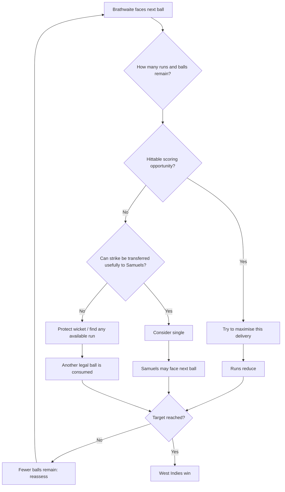
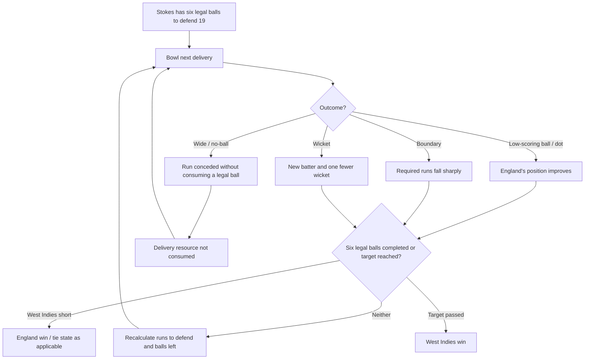

# 2016 World T20 Final — Reporting File

## Why this match matters

This is our clearest example for the Study 21 question:

**How does a fixed number of deliveries change the problem?**

The reporting job is not to retell Carlos Brathwaite's famous four sixes. It is to show what happens when the batting side has a fixed stock of legal deliveries left and each one disappears permanently as it is used.

This contrasts with the two Test examples:

- **Headingley 2019:** England still had to score the runs; the interesting problem was who faced future deliveries.
- **Sydney 2021:** India eventually stopped chasing the target; the scarce resource became Australia's remaining playing opportunity.
- **Kolkata 2016:** the constraint is explicit and finite — West Indies have six legal deliveries left to get the runs.

## Core reporting question

**What changes when every legal delivery used is one fewer remaining opportunity to score the required runs?**

## Facts established

- [x] Match: England v West Indies, ICC World Twenty20 final, Eden Gardens, Kolkata, 3 April 2016.
- [x] England scored 155/9 from 20 overs.
- [x] West Indies therefore needed 156 to win.
- [x] West Indies reached the end of the 19th over at 137/6.
- [x] They needed 19 runs from the final six legal deliveries to win.
- [x] Eighteen runs would have tied the scores and taken the match to a Super Over under the competition conditions.
- [x] Marlon Samuels was 85 not out from 66 balls at the non-striker's end.
- [x] Carlos Brathwaite was 10 not out from six balls and had the strike.
- [x] Ben Stokes bowled the final over for England.
- [x] Brathwaite hit the first four deliveries for six.
- [x] The sequence was therefore: 19 from 6; 13 from 5; 7 from 4; 1 from 3; match won with two deliveries unused.
- [x] West Indies finished 161/6 after 19.4 overs and won by four wickets.
- [x] Brathwaite finished 34 not out from 10 balls; Samuels remained 85 not out.

Primary/strong sources: ICC match report and retrospective; ESPN ball-by-ball; BBC contemporary match report; direct Brathwaite interview; later Sky watchalong with Brathwaite, Stokes and Sammy.

## The state before the final over

At 137/6 after 19 overs:

- West Indies needed **19 to win**.
- They had **six legal deliveries** left.
- They still had four wickets available, so wickets were not yet the binding constraint.
- The in-form Samuels was at the non-striker's end.
- Brathwaite was on strike.

That last point links this example back to Headingley. The six remaining deliveries were finite, but they were not completely interchangeable: who faced them still mattered.

The final ball of Chris Jordan's 19th over had been a dot to Samuels. That did two things simultaneously:

1. it added no runs;
2. it left Samuels at the non-striker's end for the final over.

So one delivery changed both the arithmetic and the identity of the batter who would receive the next opportunity.

## Delivery-by-delivery reconstruction

| Before ball | Outcome | After ball | What changed analytically |
|---|---:|---|---|
| 19 needed from 6 | Brathwaite 6 | 13 from 5 | One sixth of the remaining scoring opportunities disappears, but the required runs fall by six |
| 13 from 5 | Brathwaite 6 | 7 from 4 | The required rate collapses; West Indies now need fewer than two runs per remaining ball on average |
| 7 from 4 | Brathwaite 6 | 1 from 3 | A result that looked difficult two balls earlier is now almost complete |
| 1 from 3 | Brathwaite 6 | Won with 2 balls unused | Once the target is passed, the unused deliveries cease to matter |

This is the simplest possible demonstration that **a ball has value because it is one of a limited number left**.

A dot ball at 19 from 6 would have produced 19 from 5: same required runs, fewer opportunities.

A six produced 13 from 5: fewer runs required despite the same loss of one opportunity.

The delivery always disappears. What matters is what is achieved before it does.

## Eighteen was not the same as nineteen

There is another useful state discontinuity here.

At the start of the over:

- **19 runs** won the match outright.
- **18 runs** would have levelled the scores and produced a Super Over.
- **17 or fewer** meant England won in regulation.

So the final-over problem did not have a smooth relationship between runs and outcome. One additional run could move West Indies from defeat to a tie-breaking contest, and another from that contest to immediate victory.

This is another example of Study 21's point that the value of a run depends on the state in which it is scored.

## Brathwaite's decision problem

Brathwaite later described his reasoning directly. He knew he could try to take a single and put Samuels — already 85 not out — on strike. But he also recognised a cost: if he passed up a hittable delivery and Stokes then executed yorkers against Samuels at the end of the over, the missed opportunity would be his responsibility.

His stated approach was to **maximise every delivery**.

That does not mean "always swing blindly". His contemporary explanation was that he was trying to get bat on ball and make use of the scoring opportunity in front of him. The important analytical point is that with only six balls left, declining a high-value scoring opportunity can be costly because the delivery cannot be recovered later.

### West Indies / Brathwaite decision flow

This is a reconstruction of the decision logic supported by Brathwaite's account, not a claim that he consciously followed a fixed algorithm.

## England's decision problem

England did not need a wicket to win the match. At the start of the over they could concede 17 runs and still win outright; conceding 18 would tie the scores; conceding 19 or more would lose.

That changes the fielding-side objective compared with Headingley:

- at Headingley Australia **needed a wicket**;
- here England could win simply by making six legal deliveries disappear without conceding enough runs.

Stokes' intended method was death bowling: execute yorkers and make boundary hitting difficult. Contemporary and retrospective accounts agree that England's plan was reasonable in broad terms but the execution failed — Stokes repeatedly missed the intended yorker length and Brathwaite converted those errors into sixes.

### England / Stokes decision flow

The wide/no-ball branch matters conceptually even though it did not occur in this over: the finite resource is **legal deliveries**, not every physical ball released by the bowler.

## The disappearing-resource calculation

The last over can be expressed without a complicated model:

| State | Runs needed | Legal balls left | Runs needed per ball |
|---|---:|---:|---:|
| Start | 19 | 6 | 3.17 |
| After first six | 13 | 5 | 2.60 |
| After second six | 7 | 4 | 1.75 |
| After third six | 1 | 3 | 0.33 |
| After fourth six | 0 | 2 unused | complete |

The interesting thing is not the required-rate calculation itself. Cricket spectators already understand that intuitively.

The analytical use is that it exposes the structure:

**every legal delivery changes both the score requirement and the number of remaining opportunities.**

Those two quantities evolve together.

## A useful player comment: 15 from six versus 19 from six

Daren Sammy later said West Indies practised final-over scenarios in the nets using a typical equation of **15 runs from six balls**. When 19 were required in the final, he and Chris Gayle regarded it as a stretch.

Sammy's reasoning after the first six is analytically revealing: once Brathwaite hit it, the problem became 13 from five, which suddenly looked much more manageable.

This gives us practitioner evidence for something obvious mathematically but useful journalistically: **one delivery can radically alter the feasible problem faced on the next delivery.**

## What this example adds that Headingley and Sydney do not

### Headingley

The supply of deliveries was not immediately fixed. England's central problem was to score 73 before losing one wicket, and both sides cared intensely about whether Stokes or Leach faced the next ball.

### Sydney

India eventually valued deliveries because surviving them consumed Australia's remaining playing opportunity. A dot ball could therefore be positive for the batting side.

### Kolkata

West Indies cannot merely survive a ball. Every legal delivery that produces too few runs makes the remaining chase harder because the opportunity is gone permanently.

That gives us three genuinely different uses of the same basic unit:

- **Headingley:** who receives the delivery?
- **Sydney:** can the batting side survive the delivery?
- **Kolkata:** how much can the batting side extract from the delivery before it disappears?

## What this does for the article

The 2016 final should probably be shorter than Headingley or Sydney. Its explanatory job is very specific:

**In limited-overs cricket, deliveries are an explicit finite resource.**

It demonstrates:

- runs and balls remaining must be understood together;
- using a ball without scoring can make the batting state worse even though the score is unchanged;
- a boundary can improve the state by reducing the required runs faster than the ball resource is disappearing;
- the identity of the striker still matters even under a fixed-ball constraint;
- legal deliveries, rather than clock time, are the binding resource;
- match outcomes can change discontinuously at specific run thresholds (17 / 18 / 19 in this case).

Do not let the article section become a heroic retelling of four sixes. The four sixes matter because they provide an unusually clean sequence of state changes.

## Potential article use

| Verified moment | Study 21 idea it illuminates | Why a general reader should care |
|---|---|---|
| 137/6 after 19 overs | Runs exist inside constraints | "19 needed" means something different when only six legal balls remain |
| Jordan's final dot leaves Brathwaite on strike | Remaining balls are not completely equivalent | The same finite resource is also allocated between particular batters |
| 19 from 6 | Deliveries are finite | West Indies have six opportunities left, not an indefinite period to find 19 runs |
| First six: 13 from 5 | State changes after every event | One ball is gone, but the problem becomes easier because six runs were extracted from it |
| Third six: 1 from 3 | Value is nonlinear | Three consecutive balls radically change the outcome space |
| 18 would tie; 19 wins | State-dependent value of a run | One additional run can change the formal result category |
| Win at 19.4 | Unused resources can become worthless | Once the target is reached, the final two balls have no remaining value |

## Reporting questions still open

- [ ] Verify the exact 2016 competition wording governing a tied final and Super Over if we quote the rule rather than simply report the contemporary match state.
- [ ] Do we need exact field placements for Stokes' final over? Probably not for this article unless the writing later requires them.
- [ ] Is there any reason to expand this beyond a short contrast section? Current answer: probably not.

## Sources

- ICC, "West Indies seal 2016 World Twenty20 title", 3 Apr 2016: https://www.icc-cricket.com/news/west-indies-seal-2016-world-twenty20-title
- ICC, retrospective on T20 World Cup winning moments: https://www.icc-cricket.com/media-releases/memory-lane-how-the-icc-mens-t20-world-cups-have-been-won
- ICC, "Greatest Moments" retrospective on Brathwaite: https://www.icc-cricket.com/news/postpe-greatest-moments-the-final-16-revealed
- ESPN ball-by-ball, England v West Indies final: https://www.espn.co.uk/cricket/series/8604/commentary/951373/england-vs-west-indies-final-world-t20-2016
- ESPN match report: https://www.espn.co.uk/cricket/series/8604/report/951373/
- BBC Sport contemporary match report, 3 Apr 2016: https://www.bbc.co.uk/sport/cricket/35955518
- Cricket Australia contemporary match report, 4 Apr 2016: https://www.cricket.com.au/news/3277343/6-6-6-6-and-the-windies-win-wt20
- Sky Sports, Carlos Brathwaite interview, 2 May 2016: https://www.skysports.com/cricket/news/12174/10262862/carlos-brathwaite-on-world-t20-final-and-his-approach-to-batting
- Sky Sports 2016 final watchalong with Brathwaite, Stokes and Sammy: https://www.skysports.com/cricket/news/12123/12002459/2016-world-t20-watchalong-carlos-brathwaite-ben-stokes-and-co-relive-epic-final
- The Indian Express, Brathwaite interview/reconstruction, 5 Apr 2016: https://indianexpress.com/article/sports/cricket/my-thing-was-just-to-get-the-ball-over-the-infield-says-carlos-brathwaite/lite/
